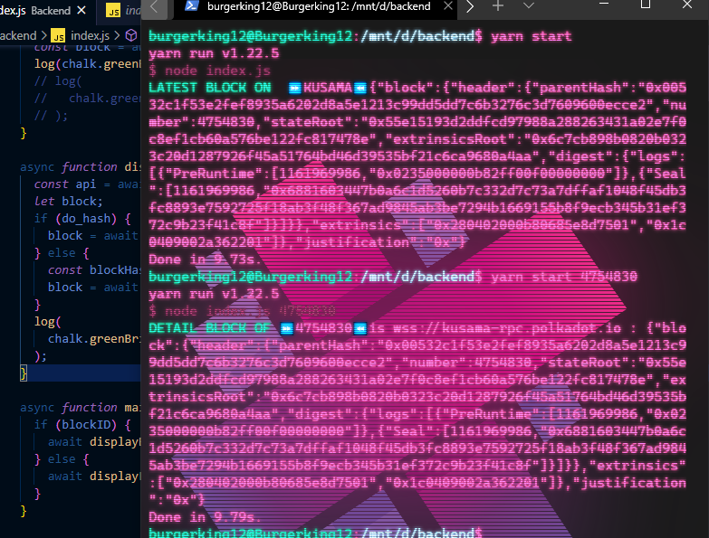

## Hackathon: Hello World! by Polkadot

# POLKADOT [BEGINNER CHALLENGES] Backend Javascript

## To install dependencies:
```sh
• yarn / yarn install
```
## To start a production:
```sh
• yarn start
```
## To find by block number:
```sh
• yarn start <Number of block>
```
- [x] example: yarn start 4754830

### Prof.of UI | SEARCH BY BLOCK NUMBER | KUSAMA
- [x] <p align="center">
    <a>
        
    </a>
</p>


### Plugins

| Plugin | Link |
| ------ | ------ |
| Subtrate | https://getsubstrate.io |
| Node Js | https://nodejs.org |
| Yarn | https://yarnpkg.com |
| Rustup | https://rustup.rs |
| Webpack |https://webpack.js.org |'

* Ask [Agin DropDisco](https://twitter.com/agin_webdev) (A.K.A) Burgerking12 :)
