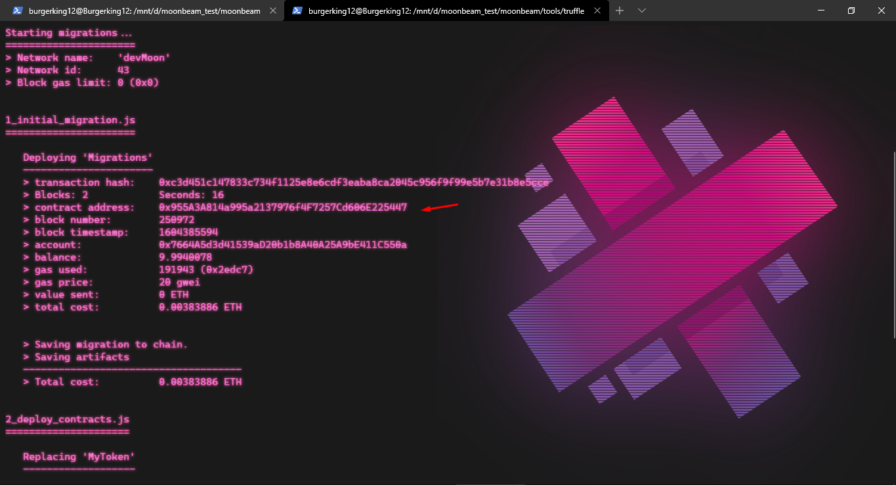
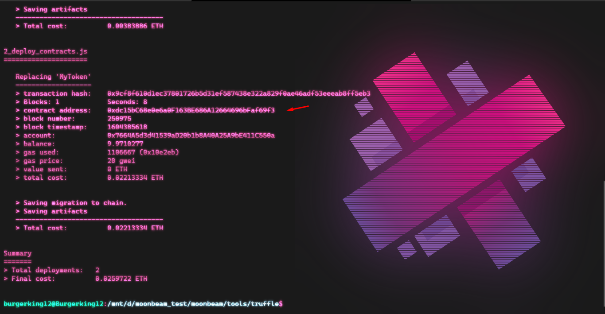

# 0x955A3A814a995a2137976f4F7257Cd606E225447,0xdc15bC68e0e6a0F163BE686A12664696bFaf69f3

### MOONBEAM [ECOSYSTEM CHALLENGE] Deploy On Moonbase Alpha Using Truffle

### Prof.of UI | compile with Truffle
- [x] 

    
    

### Plugins

| Plugin | Link |
| ------ | ------ |
| Subtrate | https://getsubstrate.io |
| Node Js | https://nodejs.org |
| Yarn | https://yarnpkg.com |
| Rustup | https://rustup.rs |
| Webpack |https://webpack.js.org |'

* Ask [Agin DropDisco](https://twitter.com/agin_webdev) (A.K.A) Burgerking12 :)
