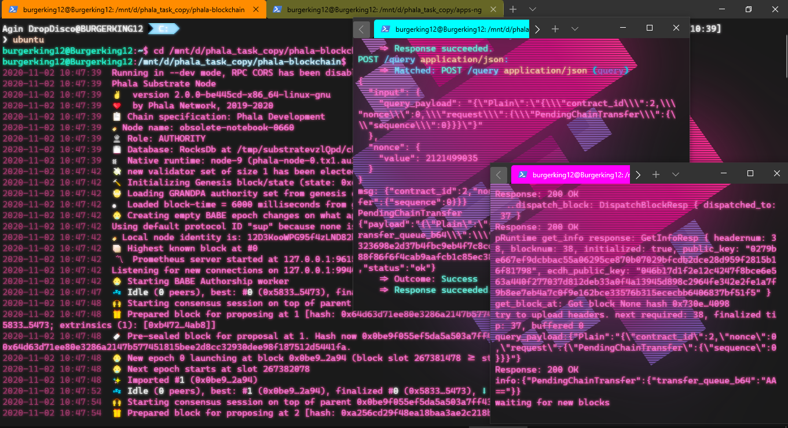
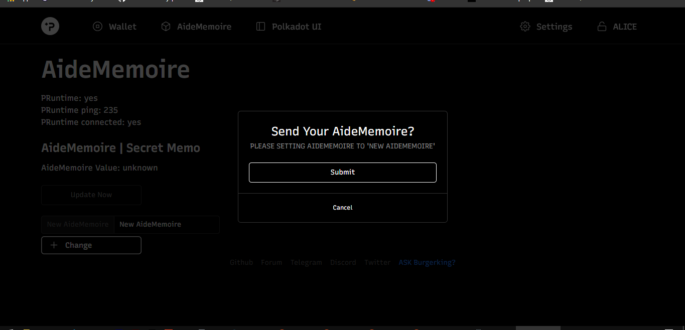
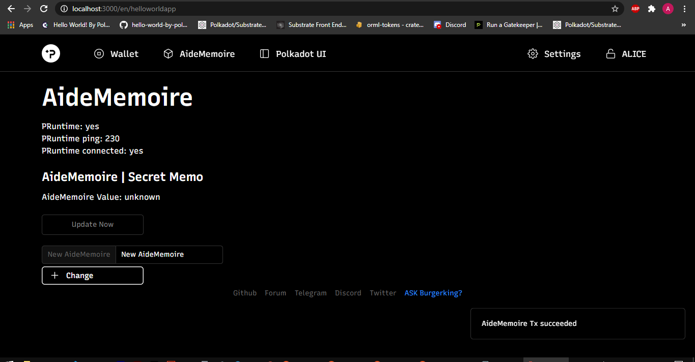
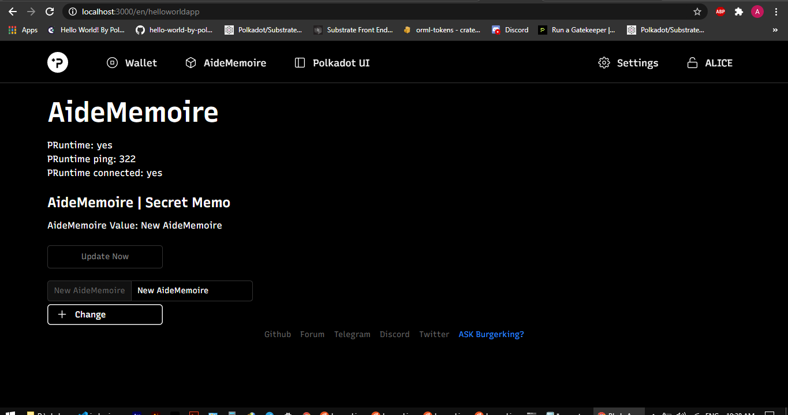

## Hackathon: Hello World! by Polkadot

# PHALA NETWORK [ECOSYSTEM CHALLENGE] (Advanced) Build The First Confidential Contract

### Prof.of UI | Terminal | Sending Tx | Sending Tx Succeeded | Update Value
- [x] 

    
  
  
  

# LINK CHANGING APPS-NG AND PHALA  BLOCKCHAIN

  - [x]  WEB UI : https://github.com/Phala-Network/apps-ng/compare/master...burgerking12:master
  - [x]  CORE BLOCKCHAIN : https://github.com/Phala-Network/phala-blockchain/compare/master...burgerking12:master

# TWITTER POST
  - [x]  TWITTER STATUS : https://twitter.com/chikal101/status/1323159400194863106

### Plugins

| Plugin | Link |
| ------ | ------ |
| Subtrate | https://getsubstrate.io |
| Node Js | https://nodejs.org |
| Yarn | https://yarnpkg.com |
| Rustup | https://rustup.rs |
| Webpack |https://webpack.js.org |'

* Ask [Agin DropDisco](https://twitter.com/agin_webdev) (A.K.A) Burgerking12 :)
