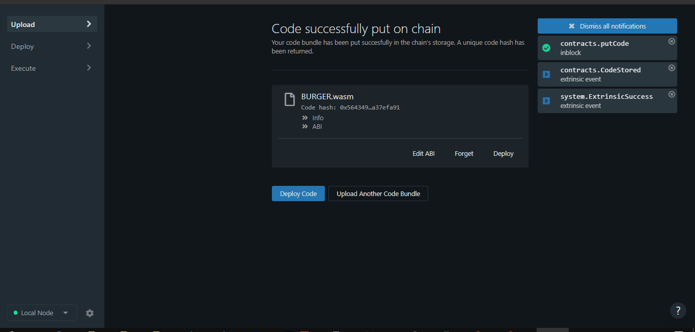
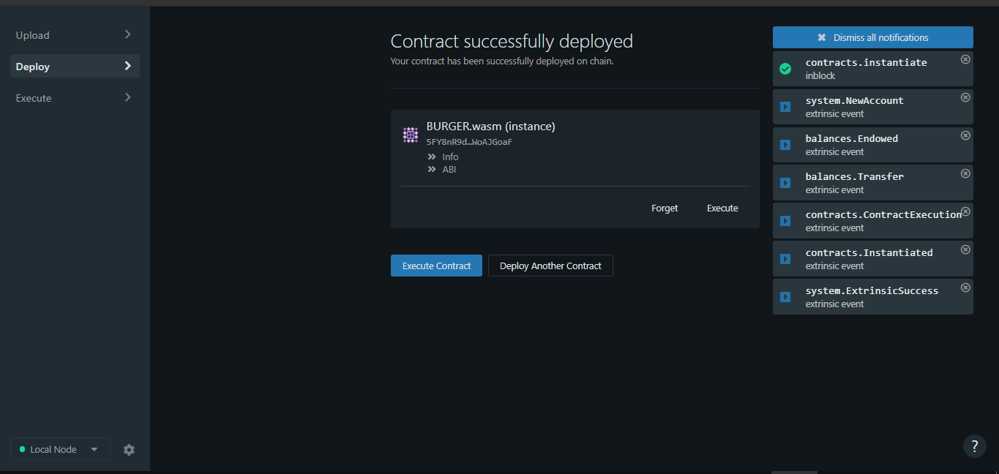
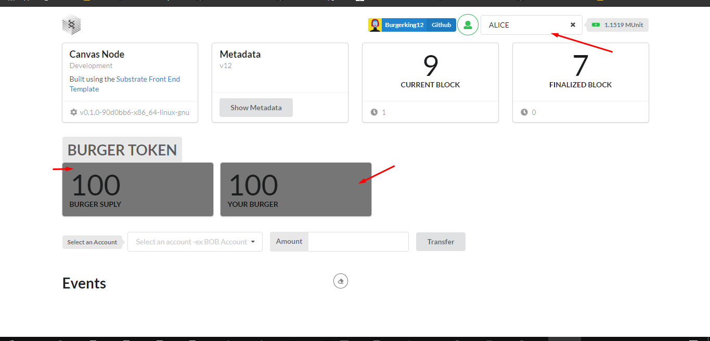
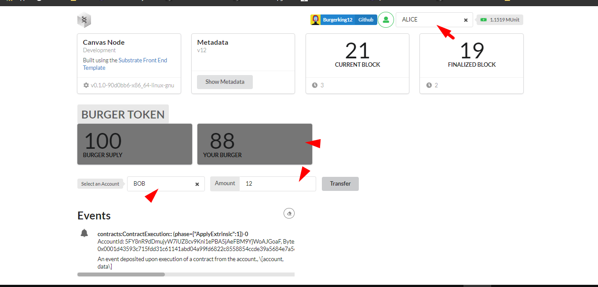
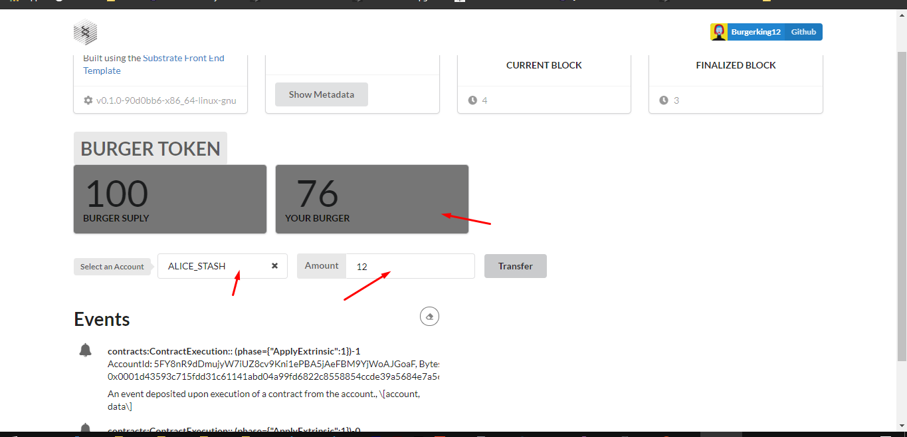
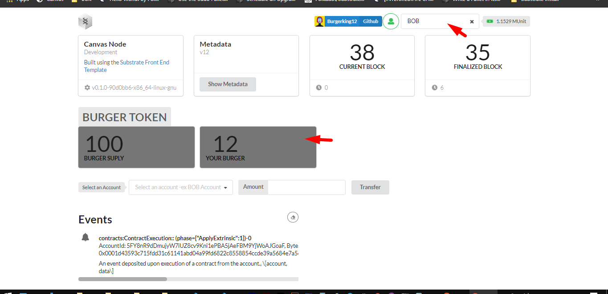

## PUT CODE ON CHAIN

    

## CONTRACT DEPLOY

    

 
 
 ## TOTAL SUPPLY

    

## ALICE (BASE) TRANSFER TO BOB ACCOUNT

    

## TOTAL ALICE (BASE) TOKEN AFTER

    

## TOTAL TOKEN OF BOB ACCOUNT NOW

    

